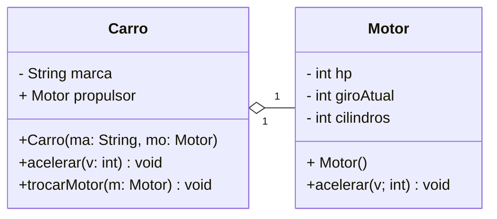
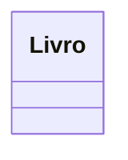

# Diagrama de classes UML

```mermaid

classDiagram
    direction LR
    Carro "1" o-- "1" Motor
    
    
    class Carro{
        - String marca
        + Motor propulsor
        +Carro(ma: String, mo: Motor)
        +acelerar(v: int)void
        +trocarMotor(m: Motor)void
    }
    
    
    
    class Motor{
        - int hp
        - int giroAtual
        - int cilindros
        + Motor()
        +acelerar(v; int)void
        }

```

```mermaid
classDiagram
    class Livro{
        
    }


```