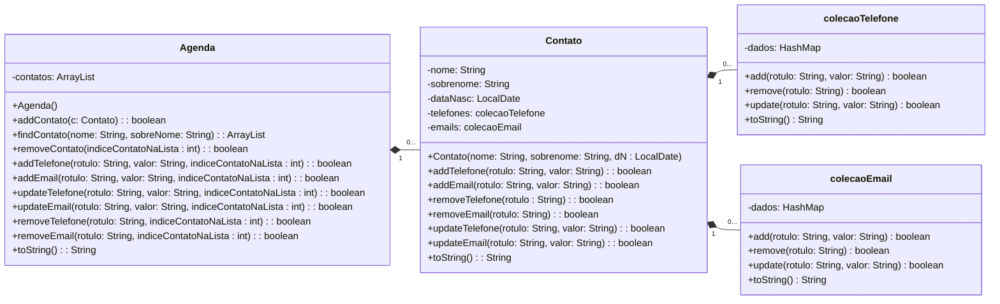

# Diagrama de classes UML

```mermaid
classDiagram
direction LR

    Agenda "1" *-- "0..." Contato
    Contato "1" *-- "0..." colecaoTelefone
    Contato "1" *-- "0..." colecaoEmail
    
    
    class Agenda{
        -contatos: ArrayList<Contato>
        +Agenda()
        +addContato(c: Contato): boolean
        +findContato(nome: String, sobreNome: String): ArrayList<Contato>
        +removeContato(indiceContatoNaLista : int): boolean
        +addTelefone(rotulo: String, valor: String, indiceContatoNaLista : int): boolean
        +addEmail(rotulo: String, valor: String, indiceContatoNaLista : int): boolean
        +updateTelefone(rotulo: String, valor: String, indiceContatoNaLista : int): boolean
        +updateEmail(rotulo: String, valor: String, indiceContatoNaLista : int): boolean
        +removeTelefone(rotulo: String, indiceContatoNaLista : int): boolean
        +removeEmail(rotulo: String, indiceContatoNaLista : int): boolean
        +toString(): String

    }
    class Contato{
        -nome: String
        -sobrenome: String
        -dataNasc: LocalDate
        -telefones: colecaoTelefone
        -emails: colecaoEmail
        +Contato(nome: String, sobrenome: String, dN : LocalDate)
        +addTelefone(rotulo: String, valor: String): boolean
        +addEmail(rotulo: String, valor: String): boolean
        +removeTelefone(rotulo : String): boolean
        +removeEmail(rotulo: String): boolean
        +updateTelefone(rotulo: String, valor: String): boolean
        +updateEmail(rotulo: String, valor: String): boolean
        +toString(): String

    }
    class colecaoTelefone{
        -dados: HashMap<String><String>
        +add(rotulo: String, valor: String)boolean
        +remove(rotulo: String)boolean
        +update(rotulo: String, valor: String)boolean
        +toString()String
    }
    class colecaoEmail{
        -dados: HashMap<String><String>
        +add(rotulo: String, valor: String)boolean
        +remove(rotulo: String)boolean
        +update(rotulo: String, valor: String)boolean
        +toString()String
    }

```