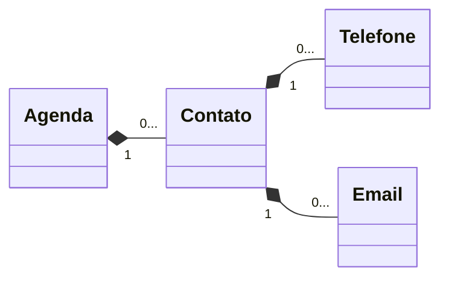

# Diagrama de classes UML

```mermaid
classDiagram
direction LR

    Agenda "1" *-- "0..." Contato
    Contato "1" *-- "0..." Telefone
    Contato "1" *-- "0..." Email
    
    
    class Agenda{
    
    }
    class Contato{
        
    }
    class Telefone{
        
    }
    class Email{
        
    }

```