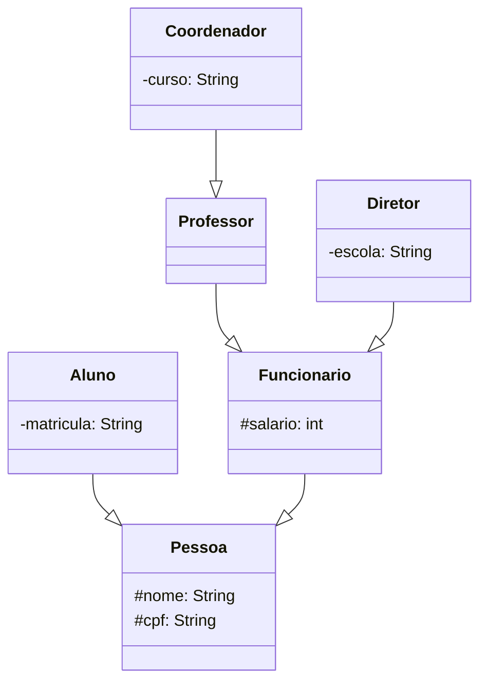
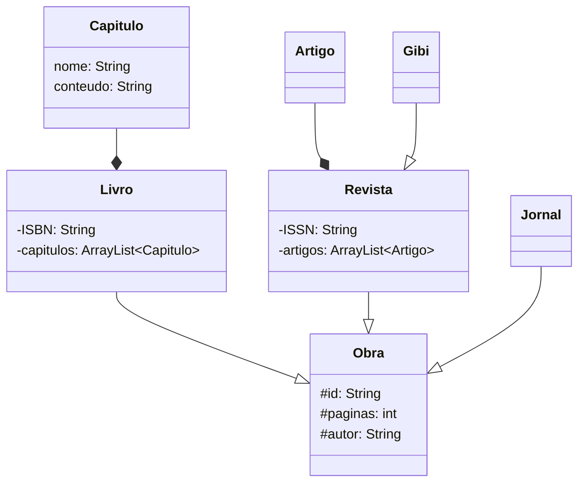

# Diagrama UML

```mermaid
classDiagram
    Aluno --|> Pessoa
    Funcionario --|> Pessoa
    Professor --|> Funcionario
    Coordenador --|> Professor
    Diretor --|> Funcionario
    
    class Pessoa{
        #nome: String
        #cpf: String
    }
    class Funcionario{
        #salario: int
    }
    class Aluno{
        -matricula: String
    }
    class Professor{
        
    }
    class Coordenador{
        -curso: String
    }
    class Diretor{
        -escola: String
    }
```

```mermaid
classDiagram
  
  Capitulo --* Livro
  Livro --|> Obra
  Revista --|> Obra
  Artigo --* Revista
  Jornal --|> Obra
  Gibi --|> Revista
  
  class Obra{
      #id: String
      #paginas: int
      #autor: String
  }
  class Capitulo{
      nome: String
      conteudo: String
  }
  class Livro{
      -ISBN: String
      -capitulos: ArrayList~Capitulo~
  }
  class Revista{
      -ISSN: String
      -artigos: ArrayList~Artigo~
  }
  class Artigo{
      
  }
  class Jornal{
      
  }
  
  

```