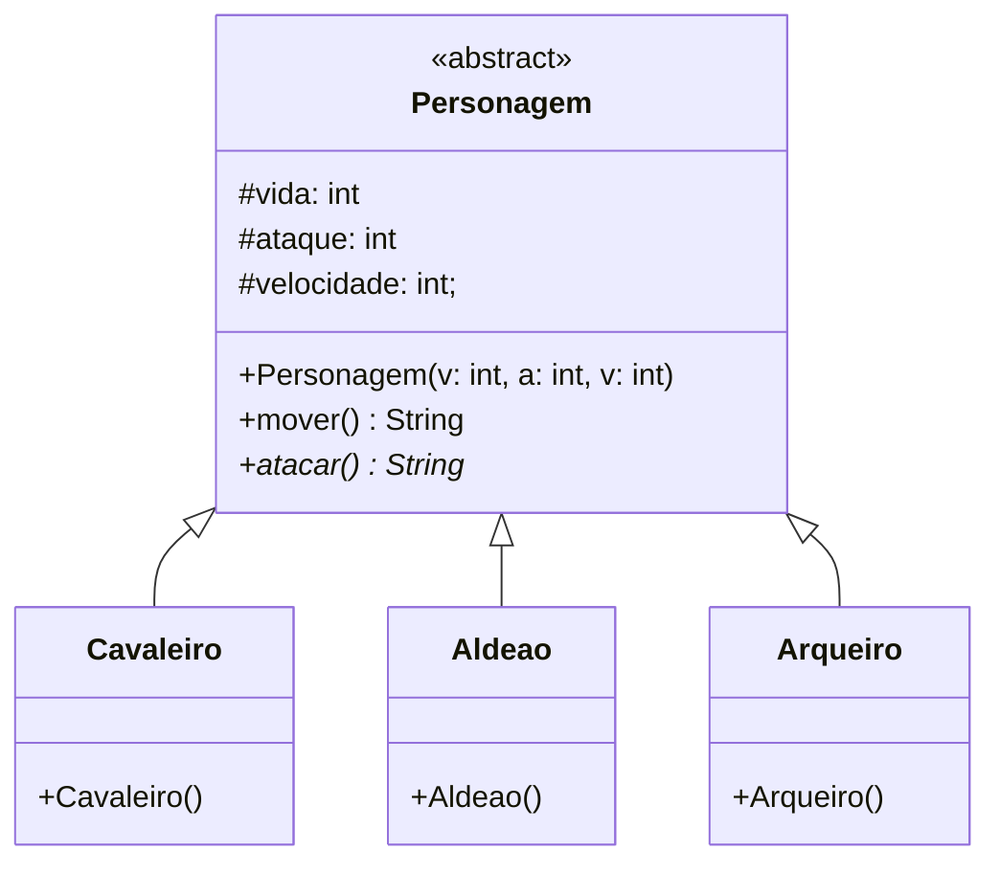

# Diagrama de Classes UML

```mermaid
classDiagram
    Personagem <|-- Cavaleiro
    Personagem <|-- Aldeao
    Personagem <|-- Arqueiro
    
    class Personagem{
        <<abstract>>
        #vida: int
        #ataque: int
        #velocidade: int;
        +Personagem(v: int, a: int, v: int)
        +mover()String
        +atacar()String*
    }
    class Aldeao{
        +Aldeao()
    }
    class Arqueiro{
        +Arqueiro()
    }
    class Cavaleiro{
        +Cavaleiro()
    }
```