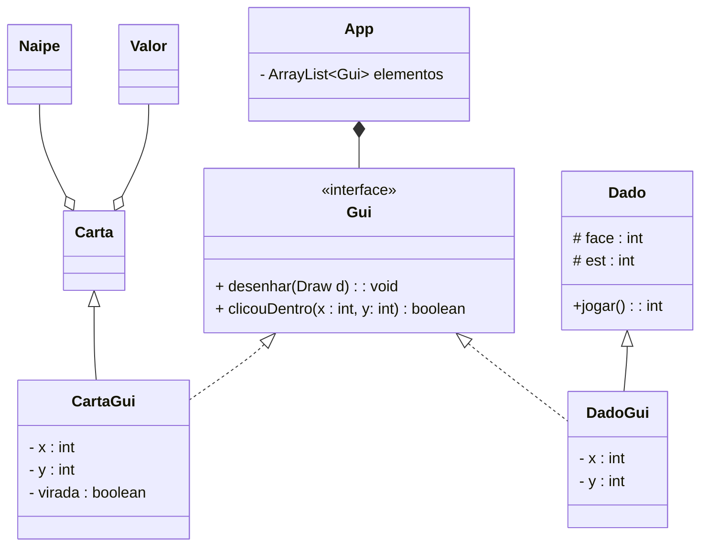

# Diagrama de classes UML

```mermaid
classDiagram
    direction TB
    
    App *-- Gui
    Carta <|-- CartaGui
    Naipe --o Carta
    Valor --o Carta
    Dado <|-- DadoGui
    Gui <|.. CartaGui
    Gui <|.. DadoGui
    
    class App{
        - ArrayList~Gui~ elementos
    }

    
    class Dado{
        # face : int
        # est : int
        
        +jogar() : int
    }

    class Gui{
        <<interface>>
        + desenhar (Draw d) : void
        + clicouDentro(x : int, y: int) boolean
    }
    class CartaGui{
        - x : int
        - y : int
        - virada : boolean
    }
    class DadoGui{
        - x : int
        - y : int
    }
    
    
    
    
    
    
    
    
    
    
    
    

```