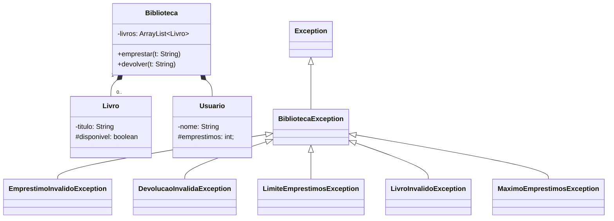

# Diagrama de classes UML

```mermaid
classDiagram
    Biblioteca "1" *-- "0.." Livro
    Biblioteca *-- Usuario
    Exception <|-- BibliotecaException
    
    BibliotecaException <|-- EmprestimoInvalidoException
    BibliotecaException <|-- DevolucaoInvalidaException
    BibliotecaException <|-- LimiteEmprestimosException
    BibliotecaException <|-- LivroInvalidoException
    BibliotecaException <|-- MaximoEmprestimosException
    class Biblioteca{
        -livros: ArrayList~Livro~
        
        +emprestar(t: String)
        +devolver(t: String)
    }
    class Livro {
        -titulo: String
        #disponivel: boolean
    }
    class Usuario{
        -nome: String
        #emprestimos: int;
    }
```