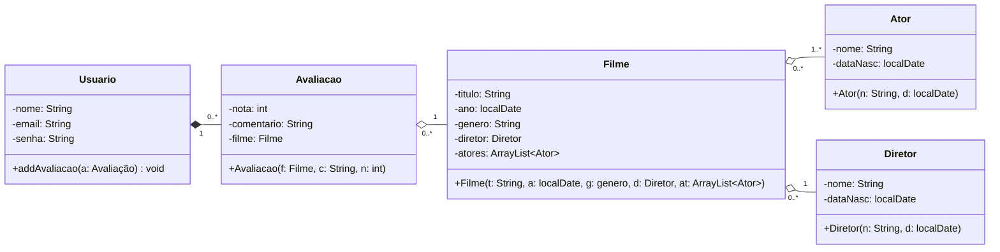

# Diagrama de classes UML

```mermaid
classDiagram
    direction LR
    
    Usuario"1" *-- "0..*" Avaliacao
    Avaliacao "0..*" o-- "1" Filme
    Filme "0..*" o-- "1..*" Ator
    Filme "0..*" o-- "1" Diretor

    class Usuario{
        -nome: String
        -email: String
        -senha: String
        +addAvaliacao(a: Avaliação)void
    }
    
    class Avaliacao{
        -nota: int
        -comentario: String
        -filme: Filme
        +Avaliacao(f: Filme, c: String, n: int)
    }
    
    class Filme{
        -titulo: String
        -ano: localDate
        -genero: String
        -diretor: Diretor
        -atores: ArrayList~Ator~
        +Filme(t: String, a: localDate, g: genero, d: Diretor, at: ArrayList~Ator~)
    }
    class Diretor{
        -nome: String
        -dataNasc: localDate
        +Diretor(n: String, d: localDate)
    }  
    
    class Ator{
        -nome: String
        -dataNasc: localDate
        +Ator(n: String, d: localDate)
    }

```