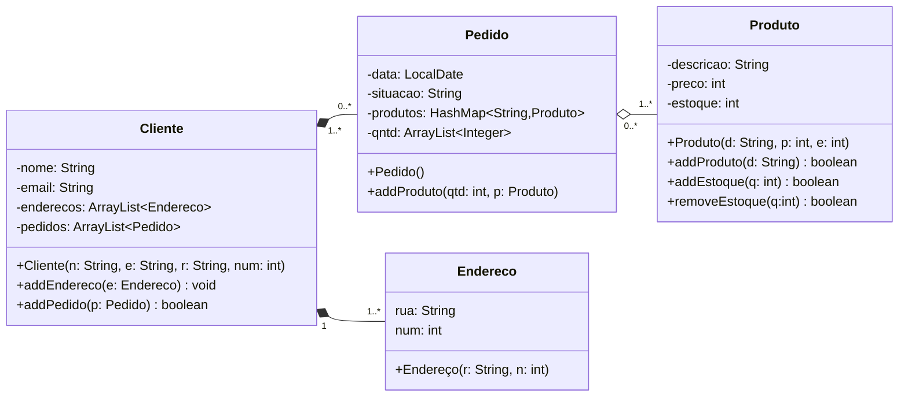

# Diagrama de classes UML

```mermaid
classDiagram
direction LR

    Cliente "1..*"*-- "0..*"Pedido
    Cliente "1" *-- "1..*" Endereco
    Pedido "0..*" o-- "1..*" Produto

    class Cliente{
        -nome: String
        -email: String
        -enderecos: ArrayList~Endereco~
        -pedidos: ArrayList~Pedido~
        +Cliente(n: String, e: String, r: String, num: int)
        +addEndereco(e: Endereco)void
        +addPedido(p: Pedido)boolean
    }
    class Endereco{
        rua: String
        num: int
        +Endereço(r: String, n: int)
    }
     
    class Pedido{
        -data: LocalDate
        -situacao: String
        
        -produtos: HashMap~String,Produto~
        -qntd: ArrayList~Integer~
        +Pedido() 
        +addProduto(qtd: int, p: Produto)
    }
    
    class Produto{
        -descricao: String
        -preco: int
        -estoque: int
        +Produto(d: String, p: int, e: int)
        +addProduto(d: String)boolean
        +addEstoque(q: int)boolean
        +removeEstoque(q:int)boolean
    }

```