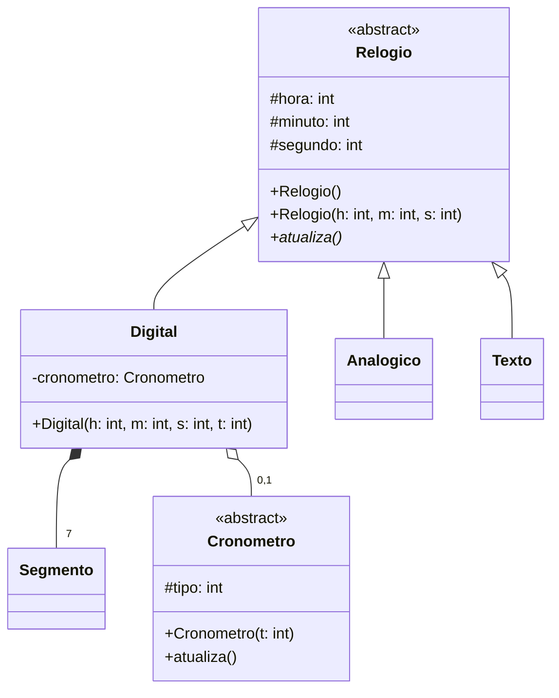

# Diagrama de classes UML

```mermaid
classDiagram
    Relogio <|-- Digital
    Relogio <|-- Analogico
    Relogio <|-- Texto
    Digital *-- "7" Segmento
    Digital o-- "0,1" Cronometro
    
    class Relogio{
        <<abstract>>
        #hora: int
        #minuto: int
        #segundo: int
        +Relogio()
        +Relogio(h: int, m: int, s: int)
        +atualiza()*
    }
    class Digital{
        -cronometro: Cronometro
        +Digital(h: int, m: int, s: int, t: int)
    }
    class Analogico{
        
    }
    class Texto{
        
    }
    class Segmento{
        
    }
    class Cronometro{
        <<abstract>>
        #tipo: int
        +Cronometro(t: int)
        +atualiza()
    }
```